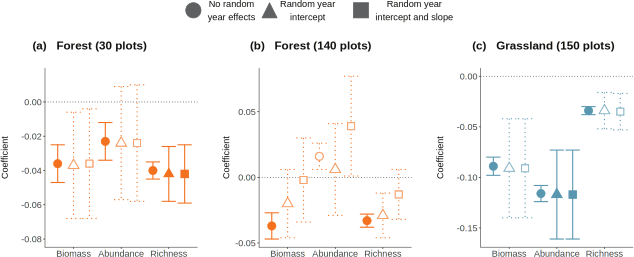
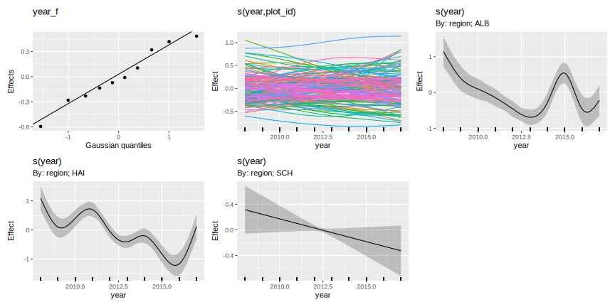
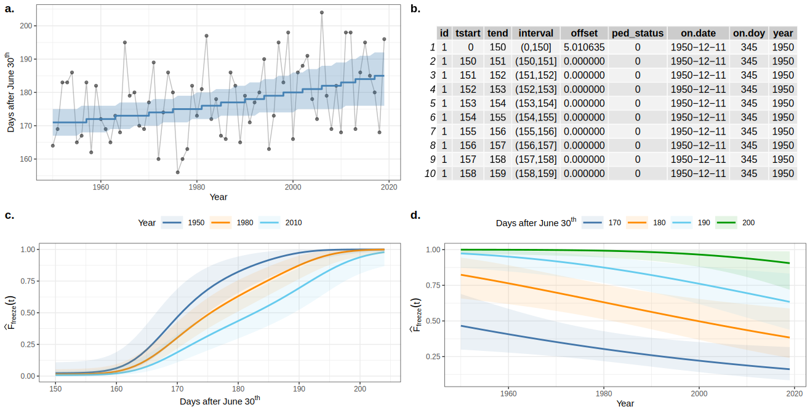
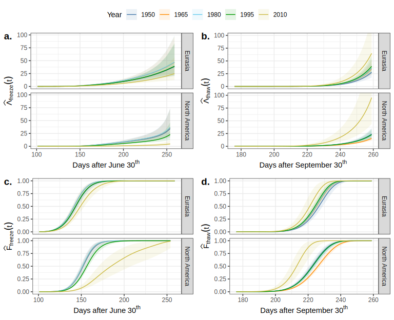

### Land acknowledgment

* This work was done at URegina on Treaty 4 lands

### Funding

.row[

.col-6[
.center[]
]

.col-6[
.center[]
]

]

### Data

* Arctic Sea Ice from [National Snow & Ice Data Center](https://nsidc.org/arcticseaicenews/)
* Lake ice data from [Global Lake and River Ice Phenology Database](http://nsidc.org/data/G01377.html)
* Lake ice study joint work with Stefano Mezzini

* bit.ly/ou-simpson-2022

<!-- ### Slides

* HTML Slide deck [bit.ly/hifmb-talk](http://bit.ly/hifmb-talk) &copy; Simpson (2020) [](http://creativecommons.org/licenses/by/4.0/) -->

???

This research was conducted while I was at the University of Regina, which is situated on the territories of the nay-hi-yuh-wuk (Cree; nêhiyawak), uh-nish-i-naa-payk (Salteaux; Anihšināpēk), Dakota, Lakota, and Nakoda, and the homeland of the Métis/Michif Nation.

---
class: inverse
background-image: url('./resources/franki-chamaki-z4H9MYmWIMA-unsplash.jpg')
background-size: cover

```{r setup, include=FALSE, cache=FALSE}
options(htmltools.dir.version = FALSE)
knitr::opts_chunk$set(cache = TRUE, dev = 'svg', echo = FALSE, message = FALSE, warning = FALSE,
                      fig.height=6, fig.width = 1.777777*6)

library("curl")
library("ggplot2")
library("dplyr")
library("tibble")
library('tidyr')
library('mgcv')
library('forcats')
library('mvnfast')
library('purrr')
library('gganimate')
library('gratia')
library('readr')
library("patchwork")
theme_set(theme_minimal(base_size = 14, base_family = 'Fira Sans'))
library('readxl')
library('here')

## constats
anim_width <- 1000
anim_height <- anim_width / 1.77777777
anim_dev <- 'png'
anim_res <- 200
```

# 

.footnote[
<a style="background-color:black;color:white;text-decoration:none;padding:4px 6px;font-family:-apple-system, BlinkMacSystemFont, &quot;San Francisco&quot;, &quot;Helvetica Neue&quot;, Helvetica, Ubuntu, Roboto, Noto, &quot;Segoe UI&quot;, Arial, sans-serif;font-size:12px;font-weight:bold;line-height:1.2;display:inline-block;border-radius:3px" href="https://unsplash.com/@franki?utm_medium=referral&amp;utm_campaign=photographer-credit&amp;utm_content=creditBadge" target="_blank" rel="noopener noreferrer" title="Download free do whatever you want high-resolution photos from Franki Chamaki"><span style="display:inline-block;padding:2px 3px"><svg xmlns="http://www.w3.org/2000/svg" style="height:12px;width:auto;position:relative;vertical-align:middle;top:-2px;fill:white" viewBox="0 0 32 32"><title>unsplash-logo</title><path d="M10 9V0h12v9H10zm12 5h10v18H0V14h10v9h12v-9z"></path></svg></span><span style="display:inline-block;padding:2px 3px">Franki Chamaki</span></a>
]

???

We learn from data because it can highlight our preconceptions and biases

---

# Learning from data

```{r lm-plot, fig.height=6, fig.width = 1.777777*6}
## simulate some data for a linear model
set.seed(1)
N <- 250
lm_dat <- tibble(x = runif(N), y = 0.5 + (2.1 * x) + rnorm(N, sd = 0.5))
## plot
ggplot(lm_dat, aes(x = x, y = y)) +
    geom_point() +
    geom_smooth(method = 'lm') +
    theme_minimal(base_size = 20, base_family = 'Fira Sans')
```

???

Learning from data could be a simple as fitting a linear regression model...

---
class: inverse
background-image: url('./resources/deep-learning-turned-up-to-11.jpg')
background-size: contain

# 

???

Or as complex as fitting a sophisticated multi-layered neural network trained on huge datasets or corpora

---

# Learning involves trade-offs

.row[
.col-6[
.center[]
]

.col-6[
.center[]
]
]

???

Learning from data involves trade offs

We can have models that fit our data well &mdash; low bias &mdash; but which are highly variable, or

We can fit models that have lower variance, but these tend to have higher bias, i.e. fit the data less well

A linear regression model is very interpretable but unless the underlying relationship is linear it will have poor fit

Deep learning may fit data incredibly well but the model is very difficult to interpret and understand

---

# Motivating example

```{r load-sea-ice, echo = FALSE}
## Load data
uri <- "https://masie_web.apps.nsidc.org/pub//DATASETS/NOAA/G02135/north/daily/data/N_seaice_extent_daily_v3.0.csv"

sea_ice <- read_csv(uri,
                    skip = 2,
                    col_names = c("year", "month", "day", "extent",
                                  "missing", "source"),
                    col_types = "iiiddc")

sea_ice <- sea_ice %>%
    mutate(date = as.Date(paste(year, month, day, sep = "-")),
           day_of_year = as.numeric(format(date, "%j")),
           yearo = ordered(year),
           yearf = factor(year),
           extent_diff = extent - lag(extent),
           extent_lag = lag(extent)) %>%
    select(c(date, extent, extent_diff, extent_lag, missing, year,
        day_of_year, yearf))


knots <- list(day_of_year = c(0.5, 366.5))

ctrl_bam <- gam.control(trace = FALSE)

m <- bam(extent ~
             s(year, k = 20, bs = "cr") +
             s(day_of_year, bs = "cc", k = 30) +
             ti(year, day_of_year, bs = c("cr", "cc"), k = c(6,6)) +
             s(yearf, bs = "re"),
         data = sea_ice, method = "fREML",
         knots = knots, discrete = TRUE, nthreads = 4, control = ctrl_bam)

## plot
sea_ice %>%
  ggplot(aes(x = day_of_year, y = extent, colour = year, group = yearf)) +
  geom_line() +
  scale_colour_viridis_c(option = "plasma") +
  labs(title = "Arctic Sea Ice Extent",
    subtitle = "October 1978 - October 2022",
    y = expression(Extent ~ (10^6 ~ km^2)),
    x = "Day of year", colour = NULL)
```

---

# Generalized Additive Models

<br />


.references[Source: [GAMs in R by Noam Ross](https://noamross.github.io/gams-in-r-course/)]

???

GAMs are an intermediate-complexity model

* can learn from data without needing to be informed by the user
* remain interpretable because we can visualize the fitted features

```{r smooth-fun-animation, results = FALSE}
f <- function(x) {
    x^11 * (10 * (1 - x))^6 + ((10 * (10 * x)^3) * (1 - x)^10)
}

draw_beta <- function(n, k, mu = 1, sigma = 1) {
    rmvn(n = n, mu = rep(mu, k), sigma = diag(rep(sigma, k)))
}

weight_basis <- function(bf, x, n = 1, k, ...) {
    beta <- draw_beta(n = n, k = k, ...)
    out <- sweep(bf, 2L, beta, '*')
    colnames(out) <- paste0('f', seq_along(beta))
    out <- as_tibble(out)
    out <- add_column(out, x = x)
    out <- pivot_longer(out, -x, names_to = 'bf', values_to = 'y')
    out
}

random_bases <- function(bf, x, draws = 10, k, ...) {
    out <- rerun(draws, weight_basis(bf, x = x, k = k, ...))
    out <- bind_rows(out)
    out <- add_column(out, draw = rep(seq_len(draws), each = length(x) * k),
                      .before = 1L)
    class(out) <- c("random_bases", class(out))
    out
}

plot.random_bases <- function(x, facet = FALSE) {
    plt <- ggplot(x, aes(x = x, y = y, colour = bf)) +
        geom_line(lwd = 1, alpha = 0.75) +
        guides(colour = FALSE)
    if (facet) {
        plt + facet_wrap(~ draw)
    }
    plt
}

normalize <- function(x) {
    rx <- range(x)
    z <- (x - rx[1]) / (rx[2] - rx[1])
    z
}

set.seed(1)
N <- 500
data <- tibble(x     = runif(N),
               ytrue = f(x),
               ycent = ytrue - mean(ytrue),
               yobs  = ycent + rnorm(N, sd = 0.5))

k <- 10
knots <- with(data, list(x = seq(min(x), max(x), length = k)))
sm <- smoothCon(s(x, k = k, bs = "cr"), data = data, knots = knots)[[1]]$X
colnames(sm) <- levs <- paste0("f", seq_len(k))
basis <- pivot_longer(cbind(sm, data), -(x:yobs), names_to = 'bf')
basis

set.seed(2)
bfuns <- random_bases(sm, data$x, draws = 20, k = k)

smooth <- bfuns %>%
    group_by(draw, x) %>%
    summarise(spline = sum(y)) %>%
    ungroup()

p1 <- ggplot(smooth) +
    geom_line(data = smooth, aes(x = x, y = spline), lwd = 1.5) +
    labs(y = 'f(x)', x = 'x') +
    theme_minimal(base_size = 16, base_family = 'Fira Sans')

smooth_funs <- animate(
    p1 + transition_states(draw, transition_length = 4, state_length = 2) + 
    ease_aes('cubic-in-out'),
    nframes = 200, height = anim_height, width = anim_width, res = anim_res, dev = anim_dev)

anim_save('resources/spline-anim.gif', smooth_funs)
```

---

# HadCRUT4 time series

```{r hadcrut-temp-example, fig.height = 6}
## Load Data
tmpf <- tempfile()
curl_download("https://www.metoffice.gov.uk/hadobs/hadcrut4/data/current/time_series/HadCRUT.4.6.0.0.annual_nh.txt", tmpf)
gtemp <- read.table(tmpf, colClasses = rep("numeric", 12))[, 1:2] # only want some of the variables
names(gtemp) <- c("Year", "Temperature")
gtemp <- as_tibble(gtemp)

## Plot
gtemp_plt <- ggplot(gtemp, aes(x = Year, y = Temperature)) +
    geom_line() + 
    geom_point() +
    labs(x = 'Year', y = expression(Temperature ~ Anomaly ~ degree*C)) +
    theme_minimal(base_size = 20, base_family = 'Fira Sans')
gtemp_plt
```

---

# Polynomials

```{r hadcrut-temp-polynomial}
p <- c(1,3,8,15)
N <- 300
newd <- with(gtemp, data.frame(Year = seq(min(Year), max(Year), length = N)))
polyFun <- function(i, data = data) {
    lm(Temperature ~ poly(Year, degree = i), data = data)
}
mods <- lapply(p, polyFun, data = gtemp)
pred <- vapply(mods, predict, numeric(N), newdata = newd)
colnames(pred) <- p
newd <- cbind(newd, pred)
polyDat <- gather(newd, Degree, Fitted, - Year)
polyDat <- mutate(polyDat, Degree = ordered(Degree, levels = p))
gtemp_plt + geom_line(data = polyDat, mapping = aes(x = Year, y = Fitted, colour = Degree),
                      size = 1.5, alpha = 0.9) +
    scale_color_brewer(name = "Degree", palette = "PuOr") +
    theme(legend.position = "right")
```

---

# How is a GAM different?

In GLM we model the mean of data as a sum of linear terms:

$$g(\mu_i) = \beta_0 + \sum_j \color{red}{ \beta_j x_{ji}}$$

A GAM is a sum of _smooth functions_ or _smooths_

$$g(\mu_i) = \beta_0 + \sum_j \color{red}{s_j(x_{ji})}$$

where $y_i \sim \mathcal{D}(\mu_i, \theta)$

---
class: inverse middle center subsection

# GAMs use splines

---
class: inverse
background-image: url('resources/wiggly-things.png')
background-size: contain

???

---

# Splines formed from basis functions

```{r basis-functions, fig.height=6, fig.width = 1.777777*6}
ggplot(basis,
       aes(x = x, y = value, colour = bf)) +
    geom_line(lwd = 2, alpha = 0.5) +
    guides(colour = FALSE) +
    labs(x = 'x', y = 'b(x)') +
    theme_minimal(base_size = 20, base_family = 'Fira Sans')
```

???

Splines are built up from basis functions

Here I'm showing a cubic regression spline basis with 10 knots/functions

We weight each basis function to get a spline. Here all the basis functions have the same weight so they would fit a horizontal line

---

# Weight basis functions &#8680; spline

```{r basis-function-animation, results = 'hide'}
bfun_plt <- plot(bfuns) +
    geom_line(data = smooth, aes(x = x, y = spline),
              inherit.aes = FALSE, lwd = 1.5) +
    labs(x = 'x', y = 'f(x)') +
    theme_minimal(base_size = 14, base_family = 'Fira Sans')

bfun_anim <- animate(
    bfun_plt + transition_states(draw, transition_length = 4, state_length = 2) + 
    ease_aes('cubic-in-out'),
    nframes = 200, height = anim_height, width = anim_width, res = anim_res, dev = anim_dev)

anim_save('resources/basis-fun-anim.gif', bfun_anim)
```

.center[]

???

But if we choose different weights we get more wiggly spline

Each of the splines I showed you earlier are all generated from the same basis functions but using different weights

---

# How do GAMs learn from data?

```{r example-data-figure, fig.height=6, fig.width = 1.777777*6}
data_plt <- ggplot(data, aes(x = x, y = ycent)) +
    geom_line(col = 'goldenrod', lwd = 2) +
    geom_point(aes(y = yobs), alpha = 0.2, size = 3) +
    labs(x = 'x', y = 'f(x)') +
    theme_minimal(base_size = 20, base_family = 'Fira Sans')
data_plt
```

???

How does this help us learn from data?

Here I'm showing a simulated data set, where the data are drawn from the orange functions, with noise. We want to learn the orange function from the data

---

# Maximise penalised log-likelihood &#8680; &beta;

```{r basis-functions-anim, results = "hide"}
sm2 <- smoothCon(s(x, k = k, bs = "cr"), data = data, knots = knots)[[1]]$X
beta <- coef(lm(ycent ~ sm2 - 1, data = data))
wtbasis <- sweep(sm2, 2L, beta, FUN = "*")
colnames(wtbasis) <- colnames(sm2) <- paste0("F", seq_len(k))
## create stacked unweighted and weighted basis
basis <- as_tibble(rbind(sm2, wtbasis)) %>%
    add_column(x = rep(data$x, times = 2),
               type = rep(c('unweighted', 'weighted'), each = nrow(sm2)),
               .before = 1L)
##data <- cbind(data, fitted = rowSums(scbasis))
wtbasis <- as_tibble(rbind(sm2, wtbasis)) %>%
    add_column(x      = rep(data$x, times = 2),
               fitted = rowSums(.),
               type   = rep(c('unweighted', 'weighted'), each = nrow(sm2))) %>%
    pivot_longer(-(x:type), names_to = 'bf')
basis <- pivot_longer(basis, -(x:type), names_to = 'bf')

p3 <- ggplot(data, aes(x = x, y = ycent)) +
    geom_point(aes(y = yobs), alpha = 0.2) +
    geom_line(data = basis,
              mapping = aes(x = x, y = value, colour = bf),
              lwd = 1, alpha = 0.5) +
    geom_line(data = wtbasis,
              mapping = aes(x = x, y = fitted), lwd = 1, colour = 'black', alpha = 0.75) +
    guides(colour = FALSE) +
    labs(y = 'f(x)', x = 'x') +
    theme_minimal(base_size = 16, base_family = 'Fira Sans')

crs_fit <- animate(p3 + transition_states(type, transition_length = 4, state_length = 2) + 
                   ease_aes('cubic-in-out'),
                   nframes = 100, height = anim_height, width = anim_width, res = anim_res,
                   dev = anim_dev)

anim_save('./resources/gam-crs-animation.gif', crs_fit)
```

.center[]

???

Fitting a GAM involves finding the weights for the basis functions that produce a spline that fits the data best, subject to some constraints

---
class: inverse middle center subsection

# Avoid overfitting our sample

---
class: inverse middle center subsection

# Use a wiggliness penalty &mdash; avoid fitting too wiggly models

---

# Fitted GAM

```{r hadcrutemp-fitted-gam}
m <- gamm(Temperature ~ s(Year), data = gtemp, correlation = corARMA(form = ~ Year, p = 1))

N <- 300
newd <- as_tibble(with(gtemp, data.frame(Year = seq(min(Year), max(Year), length = N))))
pred <- as_tibble(as.data.frame(predict(m$gam, newdata = newd, se.fit = TRUE,
                                        unconditional = TRUE)))
pred <- bind_cols(newd, pred) %>%
    mutate(upr = fit + 2 * se.fit, lwr = fit - 2*se.fit)

ggplot(gtemp, aes(x = Year, y = Temperature)) +
    geom_point() +
    geom_ribbon(data = pred,
                mapping = aes(ymin = lwr, ymax = upr, x = Year), alpha = 0.4, inherit.aes = FALSE) +
    geom_line(data = pred,
              mapping = aes(y = fit, x = Year), inherit.aes = FALSE, size = 1, colour = "#025196") +
    labs(x = 'Year', y = expression(Temeprature ~ degree*C)) +
    theme_minimal(base_size = 20, base_family = 'Fira Sans')
```

---
class: inverse middle center subsection

# Why GAMs?

---

# Why GAMs?

Originally motivated by messy irregularly-spaced time series data

--

.center[
```{r frontiers-paper, echo = FALSE}
knitr::include_graphics(here('resources', 'frontiers-paper-title.png'))
```
]

Simpson (2018, Frontiers in Ecology & Evolution)

---

# Why GAMs?

Originally motivated by messy irregularly-spaced time series data

.row[

.col-6[
* sediment cores

* samples irregularly spaced in time
]

.col-6[
```{r tom-core, echo = FALSE, out.width = "75%", fig.align = "center"}
knitr::include_graphics(here('resources', 'tom_core.jpg'))
```
]
]

---

# Why GAMs?

Originally motivated by messy irregularly-spaced time series data

Interest in the "trends" themselves not (necessarily) the temporal dependence

(Relatively) Easy to fit & &mdash; user friendly tools

Familiar

---

# GAM summary

1. GAMs give us a framework to model flexible nonlinear relationships 

2. GAMs are familiar as regression models

3. Use little functions (**basis functions**) to make big functions (**smooths**)

4. Use a **penalty** to trade off wiggliness/generality 

5. Need to make sure your smooths are **wiggly enough**


---
class: inverse middle center subsection

# Arctic sea-ice

---

```{r replot-sea-ice, out.width = "100%"}
sea_ice %>%
  ggplot(aes(x = day_of_year, y = extent, colour = year, group = yearf)) +
  geom_line() +
  scale_colour_viridis_c(option = "plasma") +
  labs(title = "Arctic Sea Ice Extent",
    subtitle = "October 1978 - October 2022",
    y = expression(Extent ~ (10^6 ~ km^2)),
    x = "Day of year", colour = NULL)
```

---

# Arctic sea-ice

$$\texttt{extent}_i \sim f(\texttt{year}_i, \texttt{day}_i) + \gamma_{j(\texttt{year}_i)}$$

```{r, echo = TRUE}
m <- bam(extent ~ s(year, k = 20, bs = "cr") +
                 s(day_of_year, bs = "cc", k = 30) +
                 ti(year, day_of_year, bs = c("cr", "cc"), k = c(6,6)) +
                 s(yearf, bs = "re"),
             data = sea_ice, method = "fREML",
             knots = knots, discrete = TRUE, nthreads = 4, control = ctrl_bam)
```
---

# Long term trend

```{r}
ds <- data_slice(m, year = evenly(year, by = 1)) |>
  mutate(yearf = factor(year, levels = year))
fv <- fitted_values(m, data = ds, scale = "response",
  exclude = c("s(day_of_year)", "ti(year,day_of_year)", "s(yearf)"))

fv |>
  ggplot(aes(x = year, y = fitted)) +
  geom_ribbon(aes(ymin = lower, ymax = upper), fill = "steelblue",
    alpha = 0.2) +
  geom_line() +
    labs(title = "Estimated long-term trend in Arctic sea-ice extent",
      y = expression(Extent ~ (10^6 ~ km^2)),
      x = NULL)
```

---

# Estimated rate of change

```{r}
derivatives(m, "s(year)", type = "central", eps = 1) |>
  ggplot(aes(x = data, y = derivative)) +
  geom_ribbon(aes(ymin = lower, ymax = upper), fill = "steelblue",
    alpha = 0.3) +
  geom_line() +
    labs(title = "Estimated rate of change in Arctic sea-ice extent",
      y = "Annual rate of change",
    x = NULL)
```

---

# Estimate extent day 250

```{r}
ds <- data_slice(m, day_of_year = 250, year = evenly(year, by = 1)) |>
  mutate(yearf = factor(year, levels = year))

fv <- fitted_values(m, data = ds, scale = "response")

fv |>
  filter(year > 1978) |>
  ggplot(aes(x = year, y = fitted)) +
  geom_ribbon(aes(ymin = lower, ymax = upper), fill = "steelblue",
    alpha = 0.2) +
  geom_line() +
    geom_point(data = sea_ice |> filter(day_of_year == 250),
      aes(y = extent, x = year)) +
  labs(title = "Arctic Sea Ice Extent",
    subtitle = "Day 250, 1978 - 2022",
    y = expression(Extent ~ (10^6 ~ km^2)),
    x = NULL, colour = NULL)
```

---
class: inverse middle center subsection

# Insectogeddon

---

# Insectogeddon

.row[
.col-6[
Insect populations are in decline

All populations?

Where?

By how much?


]

.col-6[
.center[
]
]
]
.small[
Thomas, C.D., Jones, T.H., Hartley, S.E., 2019. “Insectageddon”: A call for more robust data and rigorous analyses. Glob. Chang. Biol. 25, 1891–1892. https://doi.org/10.1111/gcb.14608
]

---

# Seibold et al 2019

Analysed 150 grassland and 140 forest sites across 3 regions of Germany 2008&ndash;2017

.center[
]

Seibold *et al* (2019) *Nature*

---

# Declining arthopod biomass, abundance, and richness

.center[
]

Seibold *et al* (2019) *Nature*

---

# Declining arthopod biomass, abundance, and richness

* Grasslands

    * Biomass &#8595; 67%

    * Abundance &#8595; 78%

    * Richness &#8595; 36%

* Forests (30 site subset)

    * Biomass &#8595; 41%

    * Richness &#8595; 36%

---

# Good and bad years

.center[

]

Fournier *et al* (2019) *Conservation Biology* [doi: 10.1111/cobi.13371](https://doi.org/10.1111/cobi.13371)

---

# Good and bad years

Daskalova *et al* (2021) attempted to account for this effect using random effects of `Year`

.center[

]

Daskalova *et al* (2021) *Insect Conservation & Diversity*

---

# Generalized Additive Models

Random effects of `Year` are one form of common trend

Random effects are a special case of a penalized spline

---

# Arthropod abundance

Negative binomial GAM fitted to single site (AEG1)

.center[
]

---

# Grassland arthropod abundance

Our example:

* Abundance of all identified Arthropods

* Grassland sites only

* Models

    * Linear global and site-specific trends (random slopes & intercepts)
    * Smooth trend of `year` plus `site` random intercepts
    * Regional smooths of `year` plus `site` random intercepts
    * Regional smooths of `year`, `site` specific *random* smooths
    * Regional smooths of `year`, year-to-year effects, `site` specific *random* smooths

---

# Random smooths?

* Random intercepts
* Random slopes
* Random smooths?

Random smooths yield a separate smooth for each subject

Share a wiggliness penalty (plus $\lambda$ for intercepts & slopes)

But individual trends can have different shape

---

# Random smooth model

`site` specific *random* smooths

.center[
]

Pedersen _et al_ (2019) [PeerJ **7**:e6876](https://doi.org/10.7717/peerj.6876)

---

# Model A

Regional smooths of `year`, `site` specific *random* smooths

.center[
]

---

# Model B

Regional smooths of `year`, year-to-year effects, `site` specific *random* smooths

.center[
]

---

# Results

* Model A (without Y2Y effects): AIC 15122 (255.7 EDF)
* Model B (with Y2Y effects): AIC 15123 (254.2 EDF)
* Equivalent mixed linear trend model (with Y2Y effects): AIC 15468 (111.8 EDF)

Use year-to-year effects or not?

--

(For these data) **A** and **B** are different ways to decompose the temporal effects

* Without Y2Y &#8594;	wigglier regional smooths
* With Y2Y &#8594; less wiggly regional smooths

???

Even with relatively simple data, GAMs yield much better fit than linear equiv.

---

# Nothing new under the sun

Fewster, Buckland, *et al* (2000) *Ecology*

(except Simon Wood's excellent {mgcv} software & ability to fit random smooths)

---

# Summary

How we model trends in biodiversity data can change our view of losses and gains

Using "smooth" trends gives much better fit for the arthropod data here

Y2Y effects and / or smooth trends represent different decompositions of the *temporal* effect

Non/linear methods needed if we want to assess changes in rates of change

---
class: inverse middle center subsection

#  Lake ice phenology

---

# Lake ice phenology

.center[
```{r include-map-figure, out.width = 550, out.height = 550}

```
]

---

# Problems

.center[
```{r include-dates-figure, out.width = 550, out.height = 550}
knitr::include_graphics("resources/dates.svg")
```
]

---

# Time-to-event data &mdash; Event history models

Follow-up times `->` Survival analysis model

Piece-wise exponential model is essentially a Poisson GLM on transformed data &mdash; hazard rate is piece-wise constant within time intervals

--

Piece-wise exponential additive mixed model &mdash, PAMM

Estimate hazard rate as a smooth function rather than a step function

Can include all of *mgcv* 📦 tools for splines & effects

*pammtools* 📦 (Bender, Groll, Scheipl, 2018 *Statistical Modelling*)

---

# PAMMs

.center[
```{r include-mendota-figure}

```
]

---

# Results

.center[
```{r include-freeze-thaw-figure, out.width = 700}

```
]

---

# Results

.center[
```{r include-spatial-freeze-figure, out.width = 550, out.height = 550}
knitr::include_graphics("resources/hpam-spatial-freeze.svg")
```
]

---

# Results

.center[
```{r include-spatial-dates-figure, out.width = 550, out.height = 550}
knitr::include_graphics("resources/hpam-change-in-dates.svg")
```
]

---

# Summary

GAMs & penalized splines are a good choice for modelling messy spatio-temporal
data

Models are Bayesian (empirical or fully Bayes) &mdash; posterior

Penalised splines are in a wide range of software

* *mgcv*, *brms*, *bamlss*, *BayesX*, *JAGS*

Can handle relatively large data: `mgcv::bam()`

Tools for evaluating fitted models

* *mgcViz*, *gratia*

---
class: inverse middle center subsection

# Extra slides

---

# Wiggliness

$$\int_{\mathbb{R}} [f^{\prime\prime}]^2 dx = \boldsymbol{\beta}^{\mathsf{T}}\mathbf{S}\boldsymbol{\beta} = \large{W}$$

$\mathbf{S}$ is a *penalty* matrix

$\boldsymbol{\beta}^{\mathsf{T}}\mathbf{S}\boldsymbol{\beta}$ is a *quadratic* penalty

---

# Making wiggliness matter

$W$ measures **wiggliness**

(log) likelihood measures closeness to the data

We use a **smoothing parameter** $\lambda$ to define the trade-off, to find the spline coefficients $\boldsymbol{\beta}$ (and $\boldsymbol{\gamma}$) that maximize the **penalized** log-likelihood

$$\mathcal{L}_p = \log(\text{Likelihood})  - \lambda W$$

---

# HadCRUT4 time series

```{r hadcrut-temp-penalty}
K <- 40
lambda <- c(10000, 1, 0.01, 0.00001)
N <- 300
newd <- with(gtemp, data.frame(Year = seq(min(Year), max(Year), length = N)))
fits <- lapply(lambda, function(lambda) gam(Temperature ~ s(Year, k = K, sp = lambda), data = gtemp))
pred <- vapply(fits, predict, numeric(N), newdata = newd)
op <- options(scipen = 100)
colnames(pred) <- lambda
newd <- cbind(newd, pred)
lambdaDat <- gather(newd, Lambda, Fitted, - Year)
lambdaDat <- transform(lambdaDat, Lambda = factor(paste("lambda ==", as.character(Lambda)),
                                                  levels = paste("lambda ==", as.character(lambda))))

gtemp_plt + geom_line(data = lambdaDat, mapping = aes(x = Year, y = Fitted, group = Lambda),
                      size = 1, colour = "#e66101") +
    facet_wrap( ~ Lambda, ncol = 2, labeller = label_parsed)
options(op)
```


---

# Picking the right wiggliness

.pull-left[
Two ways to think about how to optimize $\lambda$:

* Predictive: Minimize out-of-sample error
* Bayesian:  Put priors on our basis coefficients
]

.pull-right[
Many methods: AIC, Mallow's $C_p$, GCV, ML, REML

* **Practically**, use **REML**, because of numerical stability
* Hence `gam(..., method='REML')`
]

.center[

]

---

# Maximum allowed wiggliness

We set **basis complexity** or "size" $k$

This is _maximum wigglyness_, can be thought of as number of small functions that make up a curve

Once smoothing is applied, curves have fewer **effective degrees of freedom (EDF)**

EDF < $k$

---

# Maximum allowed wiggliness

$k$ must be *large enough*, the $\lambda$ penalty does the rest

*Large enough* &mdash; space of functions representable by the basis includes the true function or a close approximation to the tru function

Bigger $k$ increases computational cost

In **mgcv**, default $k$ values are arbitrary &mdash; after choosing the model terms, this is the key user choice

**Must be checked!** &mdash; `gam.check()`

---

# Knots?

Can avoid the knot placement problem using low-rank thin plate regression splines

---

# Thin plate splines
Default spline in {mgcv} is `bs = "tp"`

Thin plate splines &mdash; knot at every unique data value

Penalty on wiggliness (default is 2nd derivative)

As many basis functions as data

This is wasteful

---

# Low rank thin plate splines

Thin plate regression spline

Form the full TPS basis

Take the wiggly basis functions and eigen-decompose it

Concentrates the *information* in the TPS basis into as few as possible new basis functions

Retain the `k` eigenvectors with the `k` largest eigenvalues as the new basis

Fit the GAM with those new basis functions

---

# TPRS basis & penalty

.center[
```{r, echo = FALSE, dev = "png", out.width = "100%", dpi = 300}
new_df <- with(gtemp, tibble(Year = evenly(Year, n = 100)))
m <-  gam(Temperature ~ s(Year), data = gtemp, method = "REML")
S <- penalty(m, smooth = "s(Year)")
bfun <- basis(s(Year), data = new_df, constraints = TRUE)
p1 <- draw(bfun) + facet_wrap(~ bf)
p2 <- draw(S)
p1 + p2 + plot_layout(ncol = 2)
```
]

---

# CRS basis & penalty

.center[
```{r, echo = FALSE, dev = "png", out.width = "100%", dpi = 300}
m <- gam(Temperature ~ s(Year, bs = "cr"), data = gtemp, method = "REML")
S <- penalty(m, smooth = "s(Year)")
bfun_cc <- basis(s(Year, bs = "cr"), data = new_df, constraints = TRUE)
p1 <- draw(bfun_cc) + facet_wrap(~ bf)
p2 <- draw(S)
p1 + p2 + plot_layout(ncol = 2)
```
]
